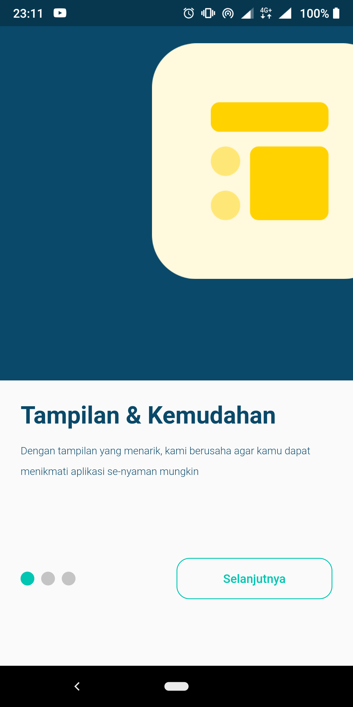
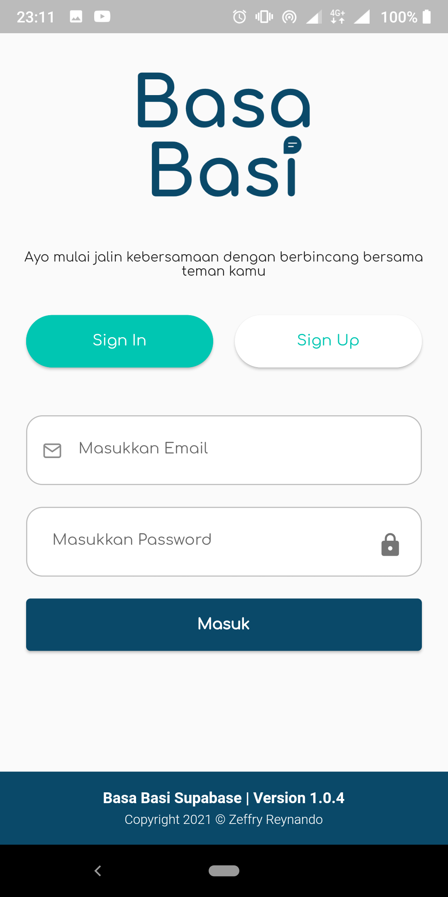
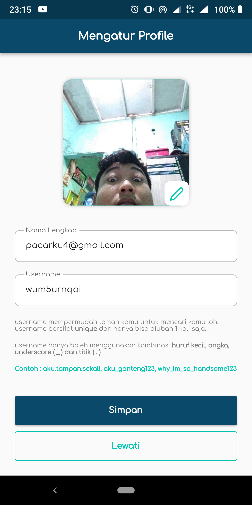
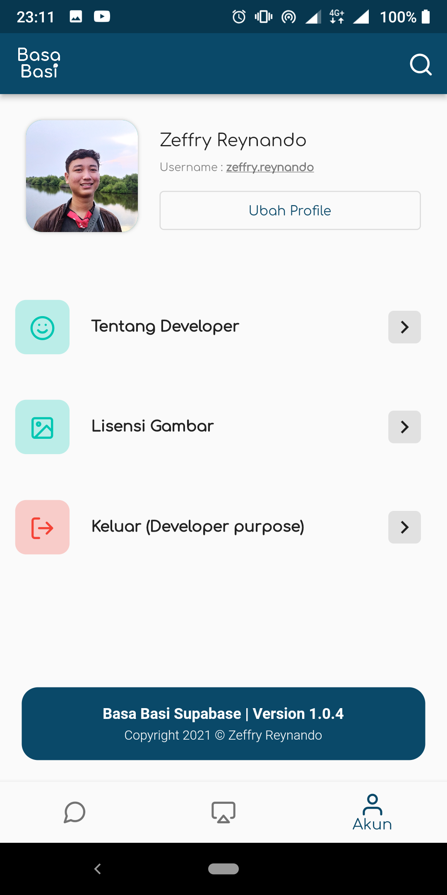
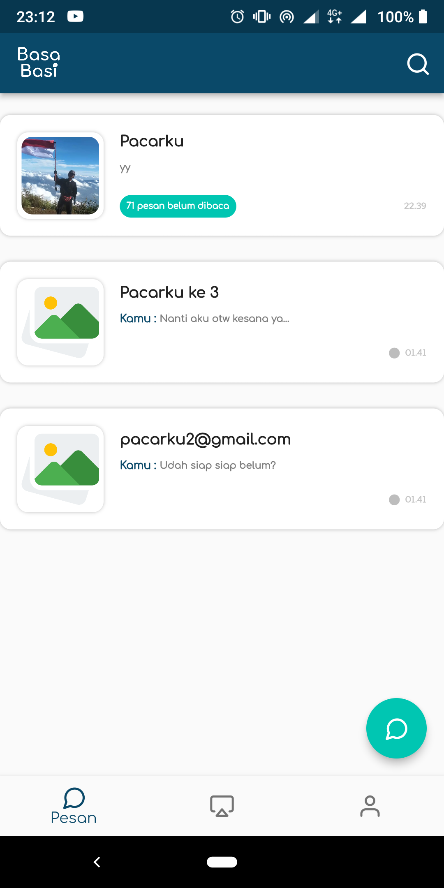
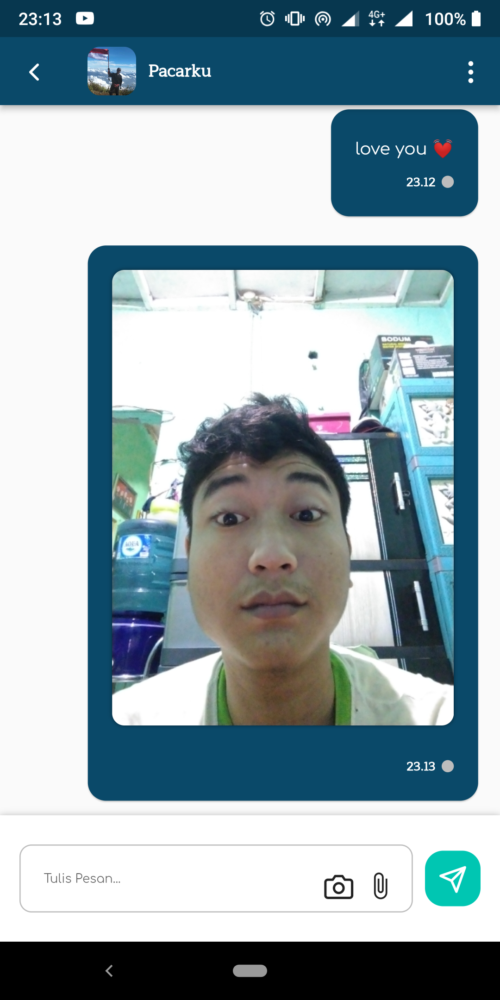
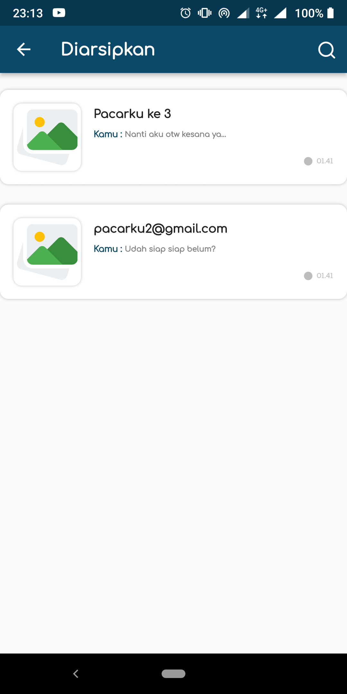
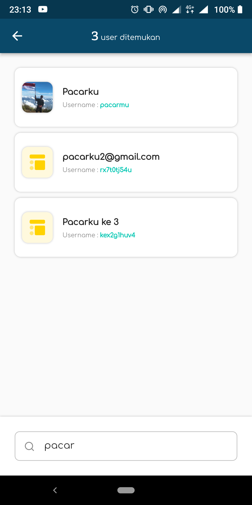
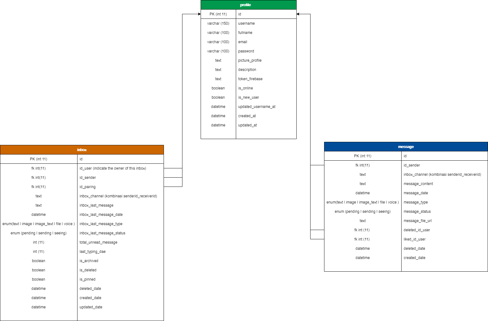
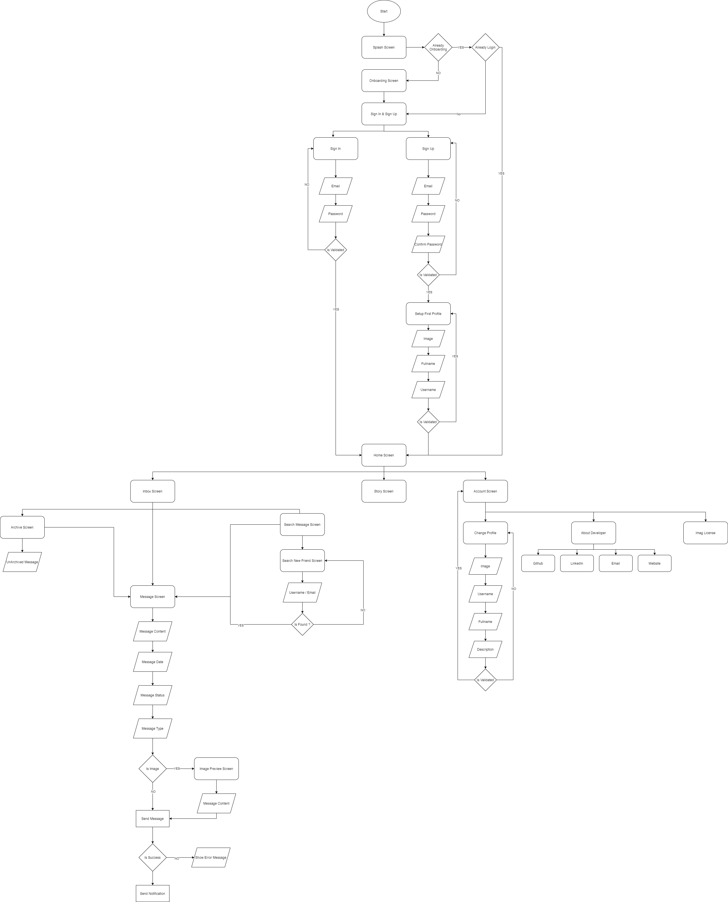

  

# Basa Basi (Supabase Version)

Mau Ngelindur, Ngelantur, Curhat, PDKT, Pinjam Uang ?
Diawali dengan Basa-Basi...

## Description 

Simple chat application use **Supabase** as backend and **Flutter** as Front-End. This is SQL (Postgre) version of **Basa Basi** application.

Use **Riverpod** as State Management and **Firebase Messaging** for sending notification.

 

## Preview 

<table>
  <tbody>
    <tr>
      <th>Onboarding</th>
      <th>Sign In/Up</th>
      <th>Setup Profile</th>
      <th>Profile</th>
    </tr>
    <tr>
      <td></td>
      <td></td>
      <td></td>
      <td></td>
    </tr>
    <tr>
      <th>Inbox</th>
      <th>Message</th>
      <th>Archive</th>
      <th>Search Friend</th>
    </tr>
    <tr>
      <td></td>
      <td></td>
      <td></td>
      <td></td>
    </tr>
  </tbody>
<table>

## Design Database

  

## Basa Basi Supabase World

  

## Features 

- [x] Onboarding Screen
- [x] Sign In/Up with email & password
- [x] Setup Profile when first registration
- [x] Update Profile
- [x] Realtime chat
- [x] Search our message
- [x] Search New Friend
- [x] Count unread message
- [x] Status Read/Send
- [x] Realtime typing status
- [x] Grouped message by date
- [x] Send image with camera/gallery
- [x] Archive/unArchive message 
- [x] Grouped Notification

## Future Features (F.F)

- [] Save message to local database (currently this application very depending on internet connection)
- [] Pinned Chat
- [] Story
- [] Emoticon
- [] Deleted Inbox
- [] Deleted each message
- [] Like message
- [] Favorite message
- [] Muted Notification
- [] Dark/Light/Automatic mode
- [] Custom own message screen (walpaper, buble chat, font ...)
- [] Backup chat 😕 ?
- [] And many more...

# Issues

Please file any issues, bugs or feature request as an issue on <a href="https://github.com/zgramming/Basa-Basi-Supabase/issues"><b> Github </b></a>

# Contributing

Pull requests are welcome. For major changes, please open an issue first to discuss what you would like to change.

 

<table border="0" cellspacing="0" cellpadding="0">
    <thead>
        <tr>
            <th>Github</th>
            <th>LinkedIn</th>
            <th>Facebook</th>
            <th>Instagram</th>
            <th>Website</th>
        </tr>
    </thead>
    <tbody>
        <tr>
            <td>
            
            </td>
            <td></td>
            <td></td>
            <td></td>
            <td></td>
        </tr>
    </tbody>

</table>